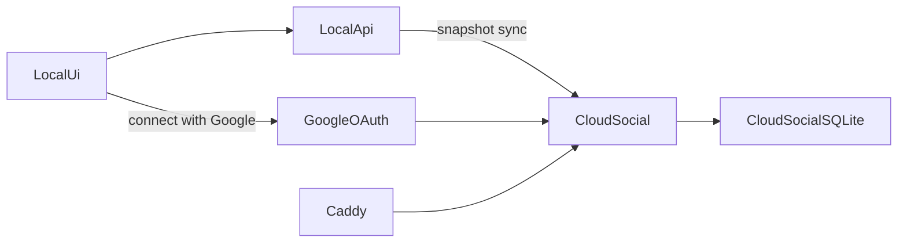

# Cloud Social VPS Setup

This document describes how to run `backend/cloud-social` on a VPS at `https://slaythelist.nicohillbrand.com` with:

- Google OAuth
- a Node process managed by `systemd`
- Caddy as the HTTPS reverse proxy

## Current production deployment (`srv1252048`)

The live VPS diverges from the recommended layout below — it was set up on the
`nico` user account, not a dedicated `slaythelist` system user. **Use these
paths when SSHed in**, not the ones in [deploy/cloud-social/cloud-social.service](../deploy/cloud-social/cloud-social.service):

| Setting | Production value |
|---|---|
| Service unit | `/etc/systemd/system/cloud-social.service` |
| `User=` | `nico` |
| `WorkingDirectory=` | `/home/nico/apps/SlayTheList` |
| `EnvironmentFile=` | `/etc/slaythelist/cloud-social.env` |
| `CLOUD_SOCIAL_DATA_DIR` | `/home/nico/apps/SlayTheList/data/cloud-social` |
| Listen port | `8790` (Caddy reverse-proxies from `slaythelist.nicohillbrand.com`) |

The repo's `deploy/cloud-social/cloud-social.service` template still says
`User=slaythelist` / `/opt/slaythelist`. Don't copy it over the live unit —
it would fail to start because no `slaythelist` user exists on this box.

### Redeploy steps (the ones that actually work)

```bash
ssh srv1252048
cd ~/apps/SlayTheList

git fetch origin
git reset --hard origin/main      # pull may fail if VPS history diverged; reset is safe
                                   # because data lives outside the repo
npm install                        # only if package.json changed
npm run build                      # rebuilds contracts → api → cloud-social → web

sudo systemctl restart cloud-social
sudo systemctl status cloud-social --no-pager
sudo journalctl -u cloud-social -n 30 --no-pager
curl -s https://slaythelist.nicohillbrand.com/health
```

### Verifying SQLite migrations applied

`sqlite3` CLI isn't installed on the box. Use the workspace's `better-sqlite3`:

```bash
cat > ~/apps/SlayTheList/.check-cols.cjs <<'EOF'
const Database = require("better-sqlite3");
const db = new Database(
  "/home/nico/apps/SlayTheList/data/cloud-social/cloud-social.db",
  { readonly: true },
);
for (const t of process.argv.slice(2)) {
  console.log(
    t + ":",
    db.prepare(`SELECT name FROM pragma_table_info('${t}')`).all().map((r) => r.name).join(", "),
  );
}
EOF
node ~/apps/SlayTheList/.check-cols.cjs user_social_settings user_social_snapshots
rm ~/apps/SlayTheList/.check-cols.cjs
```

Or `sudo apt install -y sqlite3` once and use the CLI thereafter.

### Recovering from divergent VPS history

If the VPS clone was patched directly at some point and a later history rewrite
on `origin/main` pruned old asset/scaffold commits, `git pull` will refuse to
fast-forward. Confirm with `git log --oneline origin/main..HEAD` — if those
commits are clearly stale (mobile scaffold, asset zips, etc.), `git reset
--hard origin/main` is the right move. Cloud-social data lives in
`CLOUD_SOCIAL_DATA_DIR`, **not** in the repo, so `reset --hard` only rewrites
source/build artifacts.

---

## Recommended Layout (template only — see "Current production deployment" above for the live setup)

- app checkout: `/opt/slaythelist`
- cloud-social data: `/var/lib/slaythelist/cloud-social`
- env file: `/etc/slaythelist/cloud-social.env`

## 1. DNS

Point:

- `slaythelist.nicohillbrand.com`

to your VPS public IP.

## 2. Google OAuth

Create a Google OAuth client and add this redirect URI:

- `https://slaythelist.nicohillbrand.com/api/oauth/google/callback`

If you also want local Google testing, add:

- `http://localhost:8790/api/oauth/google/callback`

You will need:

- `GOOGLE_CLIENT_ID`
- `GOOGLE_CLIENT_SECRET`

## 3. Server Dependencies

Install on the VPS:

- Node 20+
- npm
- Caddy

## 4. Deploy The Repo

Clone or update the repo to:

- `/opt/slaythelist`

Then install and build:

```bash
cd /opt/slaythelist
npm install
npm run build
```

## 5. Configure Cloud Social Env

Create:

- `/etc/slaythelist/cloud-social.env`

Based on:

- `deploy/cloud-social/cloud-social.env.example`

Example:

```bash
PORT=8790
CLOUD_SOCIAL_DATA_DIR=/var/lib/slaythelist/cloud-social
PUBLIC_CLOUD_SOCIAL_URL=https://slaythelist.nicohillbrand.com
GOOGLE_CLIENT_ID=your-google-client-id
GOOGLE_CLIENT_SECRET=your-google-client-secret
```

## 6. Install systemd Service

Copy:

- `deploy/cloud-social/cloud-social.service`

to:

- `/etc/systemd/system/cloud-social.service`

Then run:

```bash
sudo systemctl daemon-reload
sudo systemctl enable cloud-social
sudo systemctl start cloud-social
sudo systemctl status cloud-social
```

## 7. Install Caddy Config

Copy:

- `deploy/cloud-social/Caddyfile`

into your Caddy configuration.

Minimal site block:

```caddy
slaythelist.nicohillbrand.com {
  encode gzip zstd
  reverse_proxy 127.0.0.1:8790
}
```

Reload Caddy:

```bash
sudo systemctl reload caddy
```

## 8. Verify The Cloud Service

Check:

- `https://slaythelist.nicohillbrand.com/health`

It should return a JSON payload with `status: "ok"`.

## 9. Point The Local App At The VPS

Set on the local API:

```bash
CLOUD_SOCIAL_BASE_URL=https://slaythelist.nicohillbrand.com
```

For browser dev:

```powershell
$env:CLOUD_SOCIAL_BASE_URL="https://slaythelist.nicohillbrand.com"
npm run dev:api
```

For the Electron launcher, the app now passes through an existing `CLOUD_SOCIAL_BASE_URL` env value if present.

## 10. Expected Flow



## Notes

- The local app remains the source of truth for habits, predictions, and gold.
- The VPS stores the latest shareable snapshot plus social graph data.
- This setup uses SQLite on the VPS, which is fine for an initial personal deployment.
- If you later want multiple app servers or higher concurrency, move `cloud-social` to Postgres.
